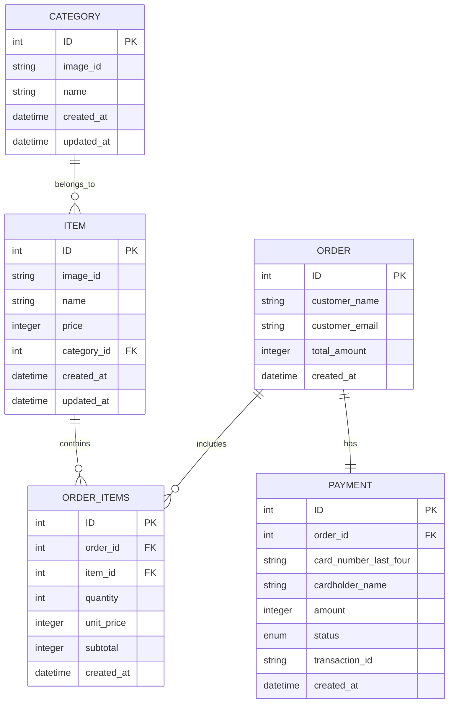

# Mashgin Take Home

This repository contains my implementation for the Full-Stack Take-Home Assignment as part of the selection process for the Mashgin Software Engineer position.

## Overview

This project consists of:

- Backend: Flask API to serve menu items and process orders.
- Frontend: React/Next.js application for user interaction.
- Database: PostgreSQL to store orders, categories and items.
- Docker: Containerization for easy setup.

For the backend, Alembic was used to control database migrations and SQLAlchemy as ORM.

### Folder structure

```
.
├── backend                             - Backend
│   ├── Dockerfile                      - Docker file
│   ├── entrypoint.sh                   - Script to run the backend
│   ├── alembic                         - Alembic migrations
│   ├── app                             - Flask API
│   │   ├── models                      - Data Models (SQLAlchemy)
│   │   ├── routes                      - Flask routes
│   │   └── utils                       - Utility functions
│   ├── tests                           - Tests
│   └── requirements.txt
├── frontend
│
├── object_storage                      - Fake Object storage 
│
├── docker-compose.yml                  - Docker Compose file
├── Makefile                            - Makefile to make it easier to setup
├── README.md                           - This file
└── postgres_data                       - PostgreSQL data

```

## How to setup


You have to have Docker and Docker Compose installed in your machine as dependencies.

The setup should be as easy as running `make setup` in the root. If, for any reason that didn't work out for you, you can remove the `sudo` in the line 4 of the Makefile and try again.

TODO: Add instructions and frontend port

After that you can access the frontend in your browser: `localhost:PORT`

## Roadmap

- [X] Setup enviroment with Docker and Docker Compose

- [ ] Backend
  - [X] Setup base Flask server.
  - [X] Setup Alembic for manage migrations
  - [X] Create data models (SQLAlchemy)
    - [X] Define Entity Relationship Diagram
    - [X] Create data models
  - [X] Create migrations (Alembic)
    - [X] Load JSON to populate database
  - [ ] Create routes
  - [ ] API Swagger (Flask-RESTPlus)
  - [ ] Tests

- [ ] Frontend
  - [ ] Search for design inspirations.
  - [ ] Setup Base Page
    - [ ] Header
    - [ ] Body
  - [ ] Setup Cart View
  - [ ] Setup Checkout Form
  - [ ] Setup dynamic functionalities
    - [ ] Populate page with categories and products
    - [ ] Add Products to Cart
    - [ ] Confirm Order

## ERD Diagram

Below we have the Entity-Relationship Diagram for our system.

Tables descriptions:

- **Category**: Defines categories for grouping menu items.
- **Item**: Stores menu items available for orders.
- **Order**: Represents the customer orders.
- **Order_Items**: Stores items included in each order.
- **Payment**: Stores payment details for each order.

A thing to put an eye on is that all the prices are stored as integers, to avoid floating point precision errors.

