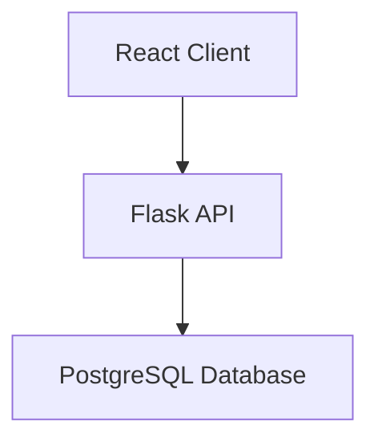
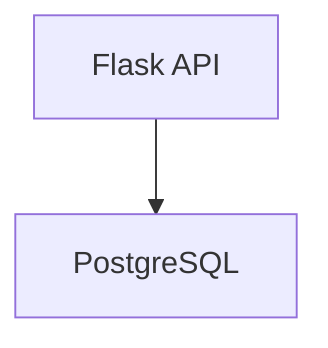
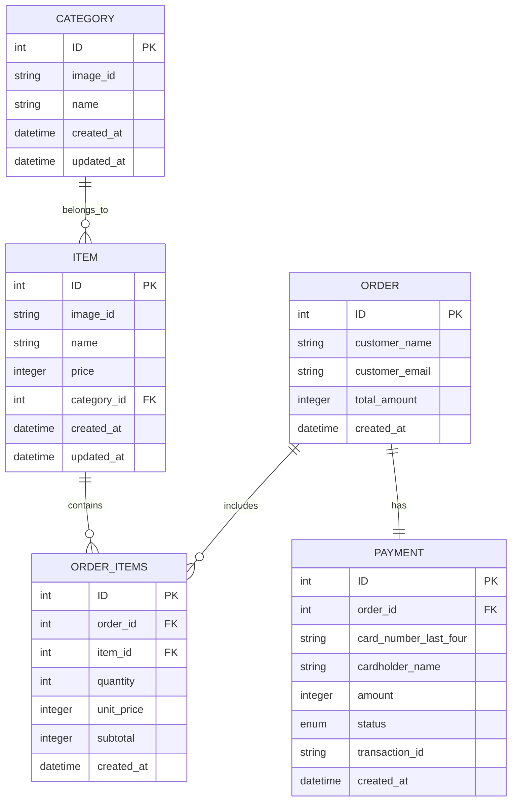

# Mashgin Take Home

This repository contains my implementation for the Full-Stack Take-Home Assignment as part of the selection process for the Mashgin Software Engineer position.

## Overview

This project consists of:

- Backend: Flask API to serve menu items and process orders.
- Frontend: React/Next.js application for user interaction.
- Database: PostgreSQL to store orders, categories and items.
- Docker: Containerization for easy setup.

For the backend, Alembic was used to control database migrations and SQLAlchemy as ORM.

## How to setup

You have to have Docker and Docker Compose installed in your machine as dependencies.

The setup should be as easy as running `make setup` in the root. If, for any reason that didn't work out for you, you can remove the `sudo` in the line 4 of the Makefile and try again.

TODO: Add instructions and frontend port

After that you can access the frontend in your browser: `localhost:PORT`

## Roadmap

- [X] Setup enviroment with Docker and Docker Compose

- [X] Backend
  - [X] Setup base Flask server.
  - [X] Setup Alembic for manage migrations
  - [X] Create data models (SQLAlchemy)
    - [X] Define Entity Relationship Diagram
    - [X] Create data models
  - [X] Create migrations (Alembic)
    - [X] Load JSON to populate database
  - [X] Create routes
  - [X] API Swagger (Flask-RESTX)
  - [X] Tests
  - [X] Documentation

- [ ] Frontend
  - [ ] Search for design inspirations.
  - [ ] Setup Base Page
    - [ ] Header
    - [ ] Body
    - [ ] Footer
  - [ ] Setup Cart View
  - [ ] Setup Checkout Form
  - [ ] Setup dynamic functionalities
    - [ ] Populate page with categories and products
    - [ ] Add Products to Cart
    - [ ] Confirm Order

# Documentation

Our project follows a pretty simple architecture.



Below we will document and describe different parts the project.

## Folder structure

```

├── backend/                             - Backend related files
├── frontend/                            - Frontend related files
├── object_storage/                      - Fake Object storage (our S3 xD) - it will contain all the images
├── docker-compose.yml                   - Docker Compose file
├── Makefile                             - Makefile to make it easier to setup
├── README.md                            - This file
└── postgres_data/                       - PostgreSQL data (created by Docker as a volume)


```

### Backend folder structure

```
├── backend/                             - Backend
│   ├── alembic/                         - Alembic migrations and configuration
│   ├── app/                             - Flask API
│   │   ├── models/                      - Data Models (SQLAlchemy)
│   │   ├── routes/                      - Flask routes (http requests handlers)
│   │   ├── services/                    - Services (business logic)
│   │   ├── __init__.py                  - Flask app initialization
│   │   ├── config.py                    - Flask app configuration (import environment variables)
│   │   └── schemas.py                   - Schemas for Flask-RESTX (API Swagger and Restricts the Input and Output of the API)
│   ├── tests/                           - Tests
│   ├── Dockerfile                       - Docker file
│   ├── alembic.ini                      - Alembic configuration file
│   ├── entrypoint.sh                    - Script to run the backend
│   └── requirements.txt                 - Python dependencies
```

### Frontend folder Structure

TODO

## Backend



Our backend is a simple Flask application that uses Flask-RESTX to create a RESTful API.
We use Alembic to manage database migrations.
SQLAlchemy is used to interact with the database.
And we use PostgreSQL as our database.

I agree that the backend could be simpler, probably just 3 files, but I wanted to keep it modular as I would do in a real project.

### ERD Diagram

Below we have the Entity-Relationship Diagram for our system.

Tables descriptions:

- **Category**: Defines categories for grouping menu items.
- **Item**: Stores menu items available for orders.
- **Order**: Represents the customer orders.
- **Order_Items**: Stores items included in each order.
- **Payment**: Stores payment details for each order.

A thing to put an eye on is that all the prices are stored as integers, to avoid floating point precision errors.



### Endpoints

You can check the endpoints in the Swagger UI at `localhost:5000`, but here are the endpoints with their respective descriptions:

#### GET /items

This endpoint retrieves a list of all categories, with their respective items. The response (200) is structured as follows:

```json
[
    {
        "id": 1,
        "image_id": "f3fbf57b118fa9",
        "name": "Bakery",
        "items": [
            {
                "id": 1,
                "image_id": "293202f9d9f7f4",
                "name": "Bagel",
                "price": 2,
                "category_id": 1
            },
            {
                "id": 2,
                "image_id": "808916fd5ddf96",
                "name": "Croissant",
                "price": 1,
                "category_id": 1
            },
            {
                "id": 3,
                "image_id": "95d02a230fe050",
                "name": "Muffin",
                "price": 1.25,
                "category_id": 1
            },
            {
                "id": 4,
                "image_id": "23f95765b967ff",
                "name": "Toast / Bread",
                "price": 1,
                "category_id": 1
            },
            {
                "id": 5,
                "image_id": "5650be5d48a99b",
                "name": "English Muffin",
                "price": 2.5,
                "category_id": 1
            }
        ]
    },
    {
        "id": 2,
        "image_id": "b271afbefdc554",
        "name": "Entrees",
        "items": [
            {
                "id": 6,
                "image_id": "bd237a0c0d19ef",
                "name": "Pasta Bar",
                "price": 12.99,
                "category_id": 2
            },
            {
                "id": 7,
                "image_id": "3e1bd1342800f7",
                "name": "Mediterranean Entree",
                "price": 10.99,
                "category_id": 2
            },
            {
                "id": 8,
                "image_id": "72589c4c990f97",
                "name": "Indian Entree",
                "price": 11.95,
                "category_id": 2
            }
        ]
    },
    {
        "id": 3,
        "image_id": "eba73b2361fae3",
        "name": "Drinks",
        "items": [
            {
                "id": 9,
                "image_id": "70c2a6247e7b58",
                "name": "Small Drink",
                "price": 0.75,
                "category_id": 3
            },
            {
                "id": 10,
                "image_id": "dba0fc03da30ca",
                "name": "Medium Drink",
                "price": 1.5,
                "category_id": 3
            },
            {
                "id": 11,
                "image_id": "ffc9bf61e441cd",
                "name": "Large Drink",
                "price": 2,
                "category_id": 3
            }
        ]
    }
]

```

#### POST /order

This endpoint creates a new order, including order items and payment details. The process is handled within a database transaction to ensure data integrity.

The request body should be a JSON object with the following structure:

```json
{
    "items": [
        {"id": 1, "quantity": 2},
        {"id": 3, "quantity": 1}
    ],
    "customer_name": "Marcelo Rodrigues",
    "customer_email": "marcelo.rodrigues.doe@example.com",
    "card_number": "1212121212121212",
    "cardholder_name": "Marcelo Eduardo",
    "cvc": "123",
    "expiration_date": "12/26"
}
```

The response (201) will be a JSON object with the following structure:

```json
{
    "order_id": 123,
    "total_amount": 5.25,
    "message": "Order created successfully"
}
```

## Frontend

TODO
