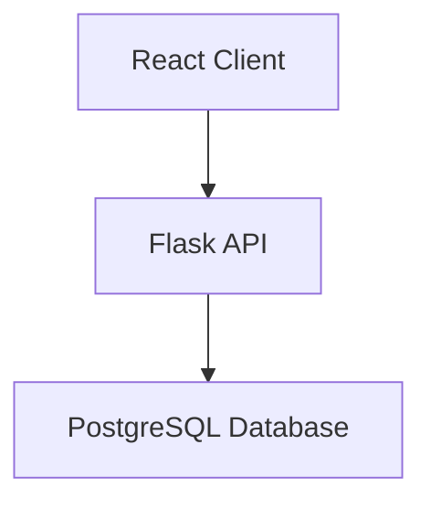
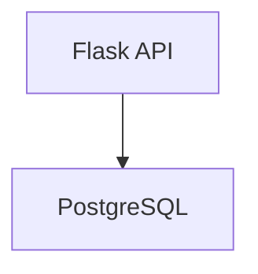
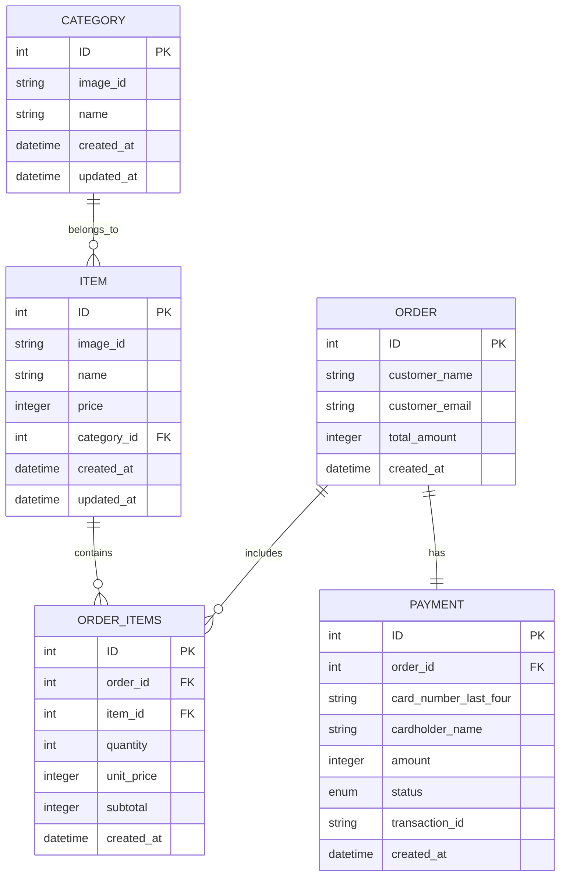
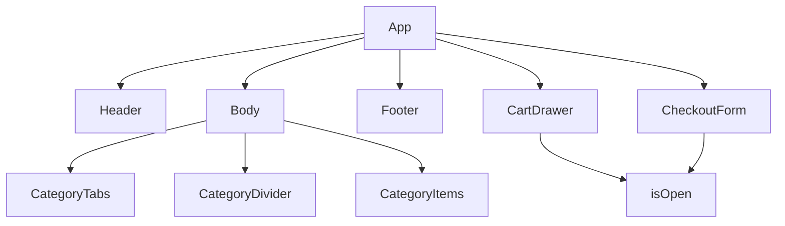
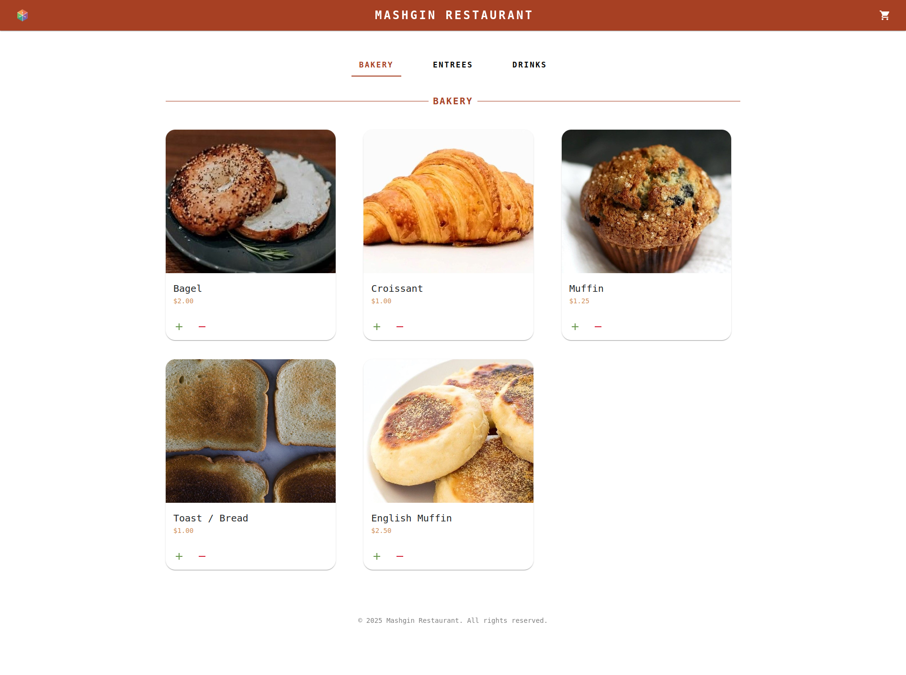
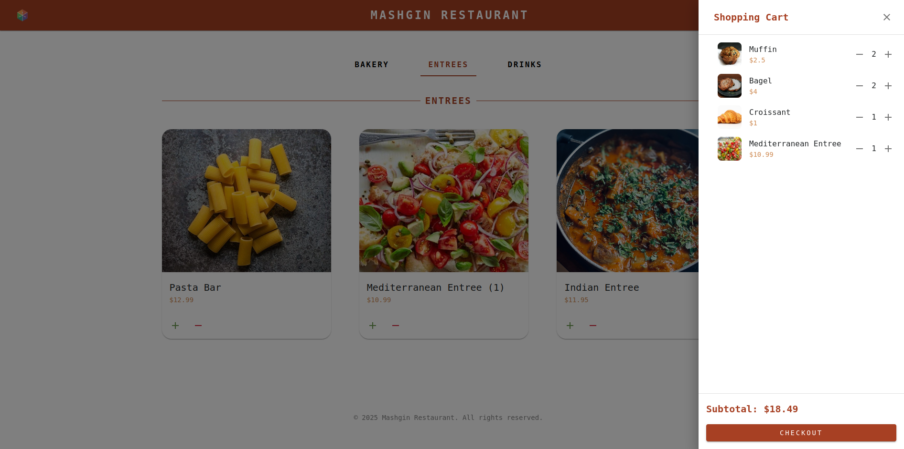
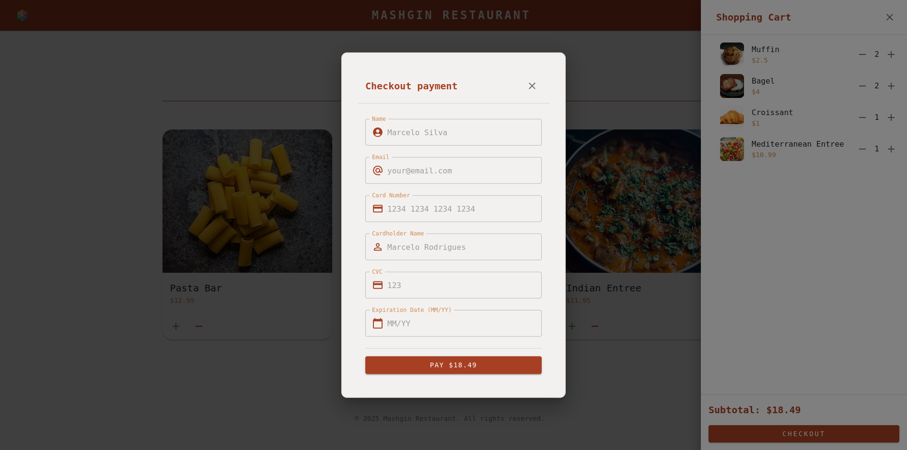

# Mashgin Take Home

This repository contains my implementation for the Full-Stack Take-Home Assignment as part of the selection process for the Mashgin Software Engineer position.

## Overview

This project consists of:

- Backend: Flask API to serve menu items and process orders.
- Frontend: React application for user interaction.
- Database: PostgreSQL to store orders, categories and items.
- Docker: Containerization for easy setup.

For the backend, Alembic was used to control database migrations and SQLAlchemy as ORM.

In the frontend, Axios was used to make API calls, Material UI for styling and React for the UI.

## How to setup

You have to have Docker and Docker Compose installed in your machine as dependencies. For reference, I used Docker version 28.0.1 and Docker Compose version 2.33.1.

The setup should be as easy as running `make setup` in the root directory (the one where the `Makefile` is). Make sure you have the ports `5000`, `5432` and `5173` available in your machine.

If, for any reason that didn't work out for you, you can remove the `sudo` in the line 4 of the Makefile and try again, or do it step by step:

1. `chmod +x backend/entrypoint.sh`
2. `sudo docker compose build`
3. `sudo docker compose up`

After that you should see 3 containers running:

1. The backend server (`mashgin_api`): `localhost:5000`
2. The database server (`mashgin_db`): `localhost:5432`
3. The frontend server (`mashgin_frontend`): `localhost:5173`

So, you can access the frontend in your browser: `localhost:5173`.

If you still have any problems, it might be because of tests not passing in the backend, you can comment them out in `backend/entrypoint.sh` line `12`.

And if after that you still couldn't run the project, please contact me, I will be more than happy to help you 😃.

## Roadmap

- [X] Setup enviroment with Docker and Docker Compose

- [X] Backend
  - [X] Setup base Flask server.
  - [X] Setup Alembic for manage migrations
  - [X] Create data models (SQLAlchemy)
    - [X] Define Entity Relationship Diagram
    - [X] Create data models
  - [X] Create migrations (Alembic)
    - [X] Load JSON to populate database
  - [X] Create routes
  - [X] API Swagger (Flask-RESTX)
  - [X] Tests
  - [X] Documentation

- [X] Frontend
  - [X] Search for design inspirations.
  - [X] Setup Base Page
    - [X] Header
    - [X] Body
    - [X] Footer
  - [X] Setup Cart View
  - [X] Setup Checkout Form
  - [X] Setup dynamic functionalities
    - [X] Populate page with categories and products
    - [X] Add Products to Cart
    - [X] Confirm Order

# Documentation

Our project follows a pretty simple architecture.



Below we will document and describe different parts the project.

## Folder structure

```

├── backend/                             - Backend related files
├── frontend/                            - Frontend related files
├── docker-compose.yml                   - Docker Compose file
├── Makefile                             - Makefile to make it easier to setup
├── README.md                            - This file
└── postgres_data/                       - PostgreSQL data (created by Docker as a volume)


```

### Backend folder structure

```
├── backend/                             - Backend
│   ├── alembic/                         - Alembic migrations and configuration
│   ├── app/                             - Flask API
│   │   ├── models/                      - Data Models (SQLAlchemy)
│   │   ├── routes/                      - Flask routes (http requests handlers)
│   │   ├── services/                    - Services (business logic)
│   │   ├── __init__.py                  - Flask app initialization
│   │   ├── config.py                    - Flask app configuration (import environment variables)
│   │   └── schemas.py                   - Schemas for Flask-RESTX (API Swagger and Restricts the Input and Output of the API)
│   ├── tests/                           - Tests
│   ├── Dockerfile                       - Docker file
│   ├── alembic.ini                      - Alembic configuration file
│   ├── entrypoint.sh                    - Script to run the backend
│   └── requirements.txt                 - Python dependencies
```

### Frontend folder Structure

A good thing to say is that all the items images are stored in the `public/images` folder, to make it easier to access them.
In a real project, you would probably use a Object Storage/CDN to store the images, and access them through a URL + image_id.

Maybe the app could be simpler, with less components, but I wanted to keep it modular.

Also the checkout form with all the validations and etc ended up being a bit complex 😅.

```
├── frontend/                               - Frontend
│   ├── public/                             - Where all the static files are stored
│   ├── src/                                - React application
│   │   ├── api/                            - Axios API definitions
│   │   ├── types/                          - Types (interfaces) definitions
│   │   ├── components/                     - Components in a modular way
│   │   ├── App.css                         - Global styles
│   │   ├── App.tsx                         - App component, where all the components are merged together
│   │   ├── index.css                       - Global styles
│   │   ├── main.tsx                        - Entry point
│   │   └── theme.ts                        - Material UI theme
│   ├── Dockerfile                          - Docker file to build the frontend (the configuration was made to work in a development environment, not production ready)
│   └── A bunch of files generated by Vite

```

## Backend



Our backend is a simple Flask application that uses Flask-RESTX to create a RESTful API.
We use Alembic to manage database migrations.
SQLAlchemy is used to interact with the database.
And we use PostgreSQL as our database.

I agree that the backend could be simpler, probably just 3 files, but I wanted to keep it modular as I would do in a real project.

The assignment says:

Should expose endpoints to fetch the menu and submit the order.
> **menu** - Use the JSON sent as resource with the assignment.

> **order** - Expected to have the items list, total and a payment object.

For the menu, I used the JSON to populate the database, instead of just returning it to the frontend.

For the order, I calculate the total in the backend, because I can't trust the values sent by the frontend (users might change it).

### ERD Diagram

Below we have the Entity-Relationship Diagram for our system.

Tables descriptions:

- **Category**: Defines categories for grouping menu items.
- **Item**: Stores menu items available for orders.
- **Order**: Represents the customer orders.
- **Order_Items**: Stores items included in each order.
- **Payment**: Stores payment details for each order.

A thing to put an eye on is that all the prices are stored as integers, to avoid floating point precision errors.



### Endpoints

You can check the endpoints in the Swagger UI at `localhost:5000`, but here are the endpoints with their respective descriptions:

#### GET /items

This endpoint retrieves a list of all categories, with their respective items. The response (200) is structured as follows:

```json
[
    {
        "id": 1,
        "image_id": "f3fbf57b118fa9",
        "name": "Bakery",
        "items": [
            {
                "id": 1,
                "image_id": "293202f9d9f7f4",
                "name": "Bagel",
                "price": 2,
                "category_id": 1
            },
            {
                "id": 2,
                "image_id": "808916fd5ddf96",
                "name": "Croissant",
                "price": 1,
                "category_id": 1
            },
            {
                "id": 3,
                "image_id": "95d02a230fe050",
                "name": "Muffin",
                "price": 1.25,
                "category_id": 1
            },
            {
                "id": 4,
                "image_id": "23f95765b967ff",
                "name": "Toast / Bread",
                "price": 1,
                "category_id": 1
            },
            {
                "id": 5,
                "image_id": "5650be5d48a99b",
                "name": "English Muffin",
                "price": 2.5,
                "category_id": 1
            }
        ]
    },
    {
        "id": 2,
        "image_id": "b271afbefdc554",
        "name": "Entrees",
        "items": [
            {
                "id": 6,
                "image_id": "bd237a0c0d19ef",
                "name": "Pasta Bar",
                "price": 12.99,
                "category_id": 2
            },
            {
                "id": 7,
                "image_id": "3e1bd1342800f7",
                "name": "Mediterranean Entree",
                "price": 10.99,
                "category_id": 2
            },
            {
                "id": 8,
                "image_id": "72589c4c990f97",
                "name": "Indian Entree",
                "price": 11.95,
                "category_id": 2
            }
        ]
    },
    {
        "id": 3,
        "image_id": "eba73b2361fae3",
        "name": "Drinks",
        "items": [
            {
                "id": 9,
                "image_id": "70c2a6247e7b58",
                "name": "Small Drink",
                "price": 0.75,
                "category_id": 3
            },
            {
                "id": 10,
                "image_id": "dba0fc03da30ca",
                "name": "Medium Drink",
                "price": 1.5,
                "category_id": 3
            },
            {
                "id": 11,
                "image_id": "ffc9bf61e441cd",
                "name": "Large Drink",
                "price": 2,
                "category_id": 3
            }
        ]
    }
]

```

#### POST /order

This endpoint creates a new order, including order items and payment details. The process is handled within a database transaction to ensure data integrity.

The request body should be a JSON object with the following structure:

```json
{
    "items": [
        {"id": 1, "quantity": 2},
        {"id": 3, "quantity": 1}
    ],
    "customer_name": "Marcelo Rodrigues",
    "customer_email": "marcelo.rodrigues@example.com",
    "card_number": "1212121212121212",
    "cardholder_name": "Marcelo Eduardo",
    "cvc": "123",
    "expiration_date": "12/26"
}
```

The response (201) will be a JSON object with the following structure:

```json
{
    "order_id": 123,
    "total_amount": 5.25,
    "message": "Order created successfully"
}
```

## Frontend

The frontend is a React application, built with Vite. It uses Material UI for styling and Axios for API calls.

### Components

The components are organized in a modular way, I will present a simple diagram to explain the components architecture.



The components are:

- **App**: The main component, where all the components are merged together.
- **Header**: The header component, with the logo title and the cart icon.
- **Body**: The body component, with the category tabs, page divider and the list of items.
  - **CategoryTabs**: The tabs component, that renders the different categories dinamically.
  - **CategoryDivider**: The divider component, that renders a line between the tabs and the items.
  - **CategoryItems**: The items component, that renders the items in a grid format.
    - **Item**: The item component, that renders a single item, with its image, name, price, quantity and buttons to add/remove it to the cart.
- **Footer**: The footer component, with a simple copyright text.
- **CartDrawer**: The cart drawer component, that renders when the cart icon is clicked in the header. Shows the items in the cart, subtotal price and a button to checkout.
- **CheckoutForm**: The checkout form component, that renders when the checkout button is clicked in the cart drawer. Shows the subtotal price, also with fields to fill with the customer information and payment details.

### Screenshots

The base page:



Cart view:



Checkout form:



# Conclusions

First of all thanks for the opportunity to work on the assignment, It gave me some fun hours.

My overall approach was to develop in the simplest way possible, but yet maintaining a structure that I would use in a real project (extensible).

Some difficulties I had:

- Figuring out the folder structure and naming is always tricky, especially since we're usually working on existing projects where the folders and files are already in place.
- Frontend is what I usually face more challenges, especially when it comes to designing and then selecting the right tools to implement the design. But in the end, I think I did a good job.
- Backend was pretty straightforward for me, the most annoying part was to setup Flask-RESTX and make sure the validations were being done correctly.

In the scope of the assignment, I think I could have done some little improvements, like:

- The design of the whole frontend could be improved based on a UX/UI study.
- The checkout form could have more strict validations, and I could have used a library to handle them, resulting in a simpler component.
- Keep cart state between page reloads.

## Next steps

Some cool next steps for making this a bigger project, thinking about usability and scalability:

- Work in security/authentication.
- Create a admin panel, where the restaurant owner can manage the categories, items and orders.
- Add a individual account feature, where the customer can create an account and consult their past orders.
- Add more payment options, such as PayPal, PIX, etc.
- Actually implement the payment process, using a payment gateway.
- Make the user current cart persistent for some time, maybe in a Key-Value store.
- Implement a search bar, to search for items by name.
- If needed, make it scalable:
  - We could add a load balancer to distribute traffic across multiple servers.
  - Implement caching for menu items to optimize performance and reduce database load, as the application is more read-intensive than write-intensive.
  - Process payments asynchronously.
  - Use a CDN to serve the images faster across the world.


## Thanks for reading!

Built with ❤️ by [SeaSkyThe](https://github.com/SeaSkyThe)
